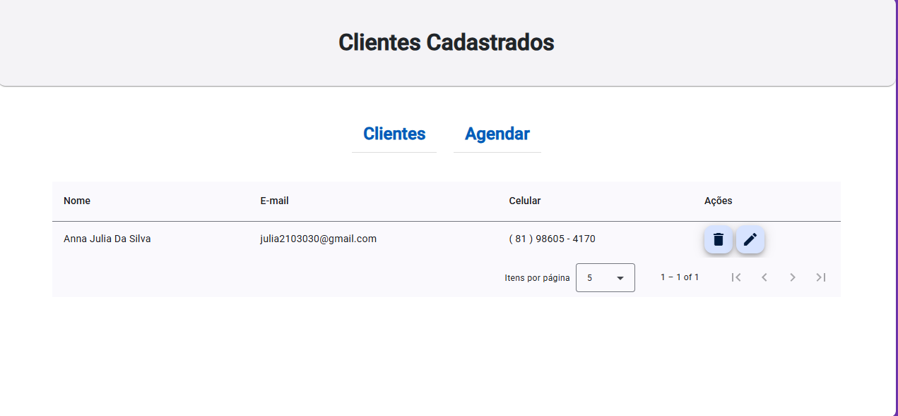

## Aplicação de Gerenciamento de Barbearia ✂️ | Back-End

Este projeto é parte de uma aplicação fullstack desenvolvida para o gerenciamento de agendamentos de uma barbearia, proporcionando aos usuários uma forma simples e eficiente de agendar horários e gerenciar serviços. O back-end foi desenvolvido com foco em performance, escalabilidade e segurança, utilizando as melhores práticas e tecnologias modernas. O repositório aqui presente refere-se ao back-end da aplicação, enquanto o front-end pode ser acessado no repositório correspondente.

### Funcionalidades ⚙️

- **Agendamento de Horários:** Sistema eficiente de marcação de horários, permitindo aos clientes agendarem serviços com facilidade.
- **Cadastro de Serviços:** Adição, edição e remoção de serviços oferecidos pela barbearia.
- **Controle de Funcionários:** Cadastro e gestão de profissionais da barbearia com atribuição de horários e serviços.
- **Gestão de Clientes:** Cadastro e controle das informações dos clientes, histórico de agendamentos, etc.
- **Autenticação e Autorização:** Implementação de sistema de login seguro, com diferentes níveis de acesso (admin, funcionário e cliente).
- **Notificações de Agendamento:** Envio de notificações por e-mail ou SMS para lembrar os clientes sobre seus agendamentos.
- **Relatórios:** Geração de relatórios sobre o desempenho da barbearia, como agendamentos realizados, serviços mais procurados, etc.

### Tecnologias Utilizadas 🛠️

  

- **Java** ☕: Linguagem de programação principal para desenvolvimento do back-end.
- **Spring Framework** 🌱: Framework utilizado para criação de aplicações corporativas e web, garantindo alta performance e segurança.
- **Gradle** ⚙️: Sistema de automação de builds para gerenciar dependências e configurações do projeto.
- **MySQL** 🗄️: Banco de dados relacional utilizado para armazenamento e gerenciamento de dados da aplicação.

### Estrutura do Projeto 🏗️

O back-end foi estruturado em camadas, seguindo o padrão arquitetural MVC (Model-View-Controller), garantindo uma organização eficiente e manutenível. O sistema também adota práticas como injeção de dependências, segurança avançada, e testes automatizados para garantir a qualidade do código.

### Imagens do Projeto 📸

---

### Contato 📞

- **LinkedIn**: [Meu LinkedIn](https://www.linkedin.com/in/anna-julia-data)
- **E-mail**: [annadsilva087@gmail.com](mailto:annadsilva087@gmail.com)

